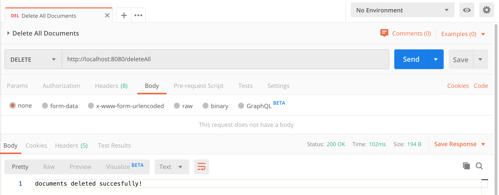

# SpringBootElasticSearch

## Things to do:
1. Clone this repository: `git clone https://github.com/hendisantika/SpringBootElasticSearch.git`
2. Go to the folder: `cd SpringBootElasticSearch`
3. Run the application: `mvn clean spring-boot:run`
4. Open your favorite browser: http://localhost:9200

## Screen shot

**Save Document**
```
POST http://localhost:8080/save
```


**Retrieved Documents**

```
GET http://localhost:8080/getAll
```


**Retrieved Document By Id**

```
GET http://localhost:8080/find/{id}
```


**Update Document By Id**


**Delete Document By Id**

```
DELETE http://localhost:8080/delete/{id}
```


**Delete All Documents**

```
DELETE http://localhost:8080/deleteAll
```


